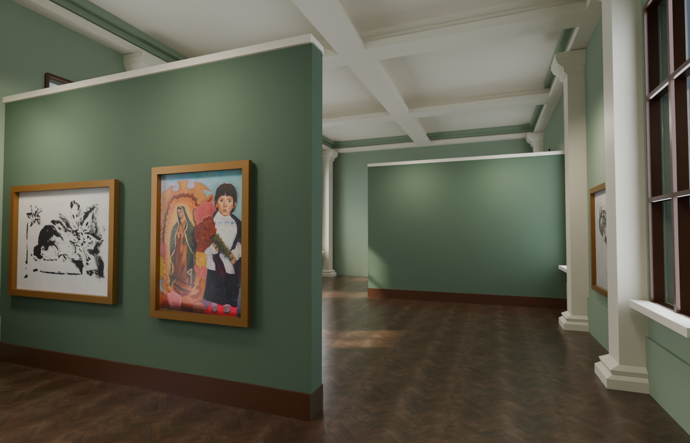

# MUNAL Virtual — Galería de Arte Interactiva

Recorrido virtual en primera persona por una sala de exhibición del siglo XIX,
desarrollado como proyecto para llevar la experiencia de una galería de arte
local a la web: caminar por el salón, acercarse a los cuadros y leer su ficha
curatorial, con iluminación horneada y audio espacial pensados para replicar
la solemnidad de un espacio patrimonial real. Inspirado en la arquitectura y
el criterio curatorial del Museo Nacional de Arte (MUNAL) de la Ciudad de
México; no es un producto oficial del museo.



## Versión actual — luz diurna y recorrido circular

Abrir **`assets/munal-gallery-daylight.blend`**. Incluye texturas empacadas,
ventanas con carpintería y cristal, un jardín exterior fotográfico, dos puertas
de madera con paneles y latón, y 14 montajes centrados. Las versiones anteriores
siguen conservadas. Generador: `scripts/create_daylight_gallery.py`, ejecutado
sobre `assets/munal-gallery-sections.blend`; rechaza sobrescribir destinos.

La app carga `public/models/munal_gallery_daylight.glb` y
`public/textures/munal_daylight_lightmap.png`. El sol direccional, el cielo y las
sombras de la carpintería están horneados en 4096²/1024 muestras. El bake usa
paredes neutras para reutilizar la irradiancia con distintas paletas; no simula
de nuevo el rebote cromático de cada color. Los lienzos mantienen una exposición
uniforme y los marcos reflejan el entorno. El jardín es un fondo panorámico situado fuera de la sala, no un
exterior transitable. Origen del recurso y prompt: [GARDEN-SOURCE](assets/GARDEN-SOURCE.md).

`public/data/artworks.json` admite cualquier número positivo de obras: agregar
fichas con id y slotIndex global únicos, imagen local, título, autor, año,
técnica, dimensiones, descripción e `isSpecial` booleano. El orden de la lista
determina el recorrido. Se permite cero o una dedicatoria especial en todo el
catálogo, independientemente de su posición. Las fichas provisionales existentes
se conservan; no se han inventado pinturas ni datos curatoriales.

`createGalleryRooms` forma una lista circular con enlaces `next` y `previous`,
máximo 14 obras por sala y montajes locales reasignados desde cero. Por ejemplo,
40 obras producen salas de 14, 14 y 12. Cada sala usa una familia de color:
salvia, granate, tierra; las mamparas llevan un tono más oscuro. Actualmente hay
ocho imágenes, así que el catálogo real forma una sola sala. Al ampliar el JSON
aparecen automáticamente las secciones adicionales.

Frente a una puerta, a menos de 2 m y mirándola, pulsar **E, F o clic**. Un
fundido oculta el cambio de obras, paleta y punto de entrada; la última sala
vuelve a la primera y la puerta opuesta retrocede. Se bloquea el movimiento
durante el cambio, se conserva Pointer Lock, se limpian fichas y proximidad, y
se respeta `prefers-reduced-motion`. Los montajes sin obra se ocultan. Las
imágenes se encajan sin recorte ni deformación en 1.8 × 1.5 m, centradas a 1.65 m.

La precarga del catálogo evita interrupciones en las transiciones y está pensada
para unas 40 imágenes optimizadas para web; catálogos mayores necesitarán carga
por sección. No incluye interfaz de subida de archivos.

Los archivos de `public/audio/` aún no están presentes. El recorrido visual
funciona sin ellos y muestra un aviso breve; el diagnóstico técnico queda en
la consola. No se ha sustituido la canción personal por audio inventado.

Validación: `npm run test:rooms` prueba cantidades de 1 a 40, 14/14/12, vuelta al
inicio, paletas, proporciones, puertas y un recorrido físico completo sobre el
GLB real. `test:room-assets` verifica el bake, cristal y colisiones; `test:scene`,
`test:gallery`, `test:audio` y `test:overlay` cubren los consumidores existentes.

## Diseño actual — tres ambientes (19 de septiembre de 2026)

Abrir **`assets/munal-gallery-sections.blend`**: es la versión editable actual,
con texturas empacadas. La anterior sigue en `assets/munal-gallery-baked.blend`.
Los archivos están en esta carpeta del proyecto en Documentos; Blender está instalado en el SSD.

Dos mamparas rojo MUNAL de 4.8 × 3.6 m dividen el recorrido en tres ambientes,
con pasos alternados de 3.2 m. Se conservan las ventanas, pilastras, artesonado,
parquet y las ocho obras actuales. Hay ocho posiciones adicionales de 1.8 × 1.2 m
marcadas con empties en la colección `Espacios_Para_Nuevas_Obras`; son reservas
de espacio en Blender. Publicar nuevas obras requiere incorporar sus imágenes,
marcos y fichas, y ampliar el catálogo de la app, que todavía valida ocho obras.

La app carga `public/models/munal_gallery_sections.glb` y
`public/textures/munal_sections_lightmap.png`, con un bake nuevo de 4096²/1024
muestras y colisiones para ambas mamparas. `npm run test:room-assets` verifica
el modelo real y el tránsito por los pasos en ambos sentidos a 30/60/144 FPS.

Generador: `scripts/create_gallery_sections.py`, ejecutado sobre el `.blend`
anterior; reutiliza el pipeline existente y rechaza destinos que ya existen.
Vista de control: `assets/munal-gallery-sections-preview.png` (render Blender).
Las siguientes secciones documentan las versiones anteriores del proyecto.

---

## Arquitectura e Ingeniería de Requerimientos

Este proyecto resuelve el desafío de trasladar la solemnidad arquitectónica y
pictórica de una sala de museo a una experiencia web interactiva en tiempo
real. Ejecutar un entorno 3D fotorrealista en navegadores de escritorio y
dispositivos móviles impuso un diseño riguroso sustentado en siete pilares de
ingeniería gráfica, acústica y de sistemas.

### 1. El desafío técnico y auditoría del stack

- **Objetivo de rendimiento:** mantener una tasa continua de **60 FPS**
  (escalable a 120 FPS en pantallas con alta tasa de refresco), eliminando
  congelamientos provocados por el recolector de basura (*Garbage
  Collection*, GC) o descompresión síncrona de texturas.
- **Evaluación del motor:**
  - *Vanilla Three.js:* excelente control de bajo nivel, pero con alta
    sobrecarga para sincronizar interfaces de usuario bidireccionales y
    modales curatoriales.
  - *Babylon.js:* sobredimensionado en huella de transferencia inicial
    (*bundle size* > 1 MB) y con shaders de post-procesado menos modulares.
  - **React Three Fiber (R3F) — selección definitiva:** permite desacoplar
    el bucle gráfico de alta frecuencia (`useFrame`) del ciclo de vida
    reactivo del DOM. Se integró junto a `@react-three/drei` y
    `@react-three/postprocessing` (N8AO y Tone Mapping ACES Filmic).

### 2. Aislamiento de estado de alta frecuencia

- **Problemática:** la lectura y escritura continua de coordenadas de
  cámara, velocidad y rotación a 60–120 Hz mediante hooks estándar de React
  (`useState`) provoca la reevaluación del árbol DOM completo, colapsando el
  hilo principal.
- **Solución:** se implementó un almacén transitorio mediante **Zustand**
  configurado con referencias mutables y suscripciones atómicas
  (`subscribeWithSelector`). La física y las transformaciones espaciales se
  computan fuera del ciclo de reconciliación de React.

### 3. Pipeline de iluminación global: precomputación vs. cálculo dinámico

- **Problemática:** calcular sombras suaves de contacto, múltiples rebotes
  de luz indirecta y oclusión ambiental en WebGL en tiempo real satura las
  GPU de consumo.
- **Solución (light baking en Cycles):**
  - Se diseñó un flujo de trabajo donde la ecuación de transporte radiativo
    se resuelve previamente en **Blender Cycles**.
  - Se proyectó un canal UV secundario (`TEXCOORD_1` / `LightmapUV`) no
    solapado con márgenes estrictos de téxeles (*island margins*) para
    prevenir el sangrado de color.
  - Se horneó exclusivamente la radiancia difusa (`Direct` + `Indirect`,
    omitiendo `Color`/Albedo) a 32 bits. Esto permite que los materiales
    `MeshStandardMaterial` en Three.js reaccionen físicamente con
    rugosidades (*roughness*) y mapas normales reales, pero con **costo
    cero de luces dinámicas en tiempo de ejecución**.

### 4. Aceleración espacial y cinemática FPS

- **Cinemática de cápsula:** el avatar se modela mediante una cápsula
  vertical cinemática orientada en el eje Y (0.35 m de radio × 1.75 m de
  altura).
- **Optimización con BVH:** en lugar de emplear costosos motores de física
  de cuerpos rígidos basados en WASM o lanzar múltiples rayos de
  intersección en CPU, se integró `three-mesh-bvh`.
- **Mallas separadas:** se desacopló la malla arquitectónica visible (con
  miles de polígonos decorativos) de una malla envolvente simplificada
  (`Collider_Room`). Las pruebas de colisión mediante *shapecast* se
  resuelven en menos de 0.5 milisegundos por fotograma.

### 5. Presupuesto de memoria (VRAM) y streaming

- **Problemática:** descomprimir ocho o más pinturas de alta resolución
  (2048×2048 a 4096×4096) en formatos JPG o PNG clásicos desborda la
  memoria de video (VRAM) en teléfonos móviles y bloquea el hilo principal
  durante la decodificación.
- **Solución:**
  - **Compresión KTX2 / Basis Universal:** transcodificación directa en
    *Web Workers* independientes mediante WebAssembly
    (`basis_transcoder.wasm`) a formatos de compresión de bloque soportados
    nativamente por la GPU (BC7 en escritorio, ASTC en móvil), reduciendo
    el consumo de VRAM hasta en un 75%.
  - **Ciclo de vida determinista:** liberación programática de
    descriptores en memoria GPU mediante métodos explícitos de
    desasignación (`geometry.dispose()` y `texture.dispose()`).

### 6. Simulación acústica espacial

- **Web Audio API + `THREE.PositionalAudio`:**
  - **Reverberación convolutiva:** implementación de un nodo
    `ConvolverNode` cargado con una respuesta al impulso (*Impulse
    Response*, IR) capturada de un espacio neoclásico de techos altos.
  - **Pasos dinámicos:** muestreo aleatorizado de pisadas sobre duela de
    madera, con intervalo modulado por la velocidad escalar del vector
    cinemático y variación aleatoria de tono (±5%).
  - **Atenuación exponencial:** posicionamiento espacial de fuentes de
    audio en obras clave, con distancias de corte configuradas para
    generar intimidad sonora al aproximarse.

### 7. Acotamiento arquitectónico y fidelidad curatorial

- **Decisión de ingeniería:** en lugar de replicar superficialmente los más
  de 5,500 metros cuadrados de un museo nacional, se concentró el
  presupuesto poligonal y de téxeles en una **sala de exhibición del siglo
  XIX (gabinete de pintura)**.
- **Calibración de materiales:**
  - Parquet de roble oscuro en espiga (*herringbone*) con barniz satinado
    (`roughness: 0.25`).
  - Lambrines de zócalo alto y muros mate en tono verde bosque porfiriano.
  - Marcos ornamentados con pan de oro (`metalness: 0.85`, `roughness: 0.3`).
  - Distribución axial simétrica con vanos de acceso y bancos de descanso
    centrales.

## Resumen del stack tecnológico

| Capa | Tecnología | Justificación |
| --- | --- | --- |
| **Core / Runtime** | React 18 + Vite + TypeScript | Compilación ultrarrápida y tipado estricto para estructuras vectoriales. |
| **Render Engine** | Three.js + React Three Fiber (R3F) | Declaratividad en la escena y acceso imperativo directo a WebGL. |
| **Post-procesado** | `@react-three/postprocessing` + N8AO | Oclusión ambiental con cálculo a media resolución (*half-res*) y ACES Filmic. |
| **Físicas / Colisión** | `three-mesh-bvh` | Intersecciones cápsula-triángulo aceleradas por árbol de jerarquías envolventes. |
| **State Management** | Zustand (estado transitorio) | Control del bucle WASD/cámara a 60–120 Hz sin provocar re-renders en React. |
| **Texturizado & Bake** | Blender 4.x/5.x (Cycles) | Precomputación de luz difusa indirecta exportada en segundo canal UV (`TEXCOORD_1`). |
| **Audio** | Web Audio API + ConvolverNode | Reverberación acústica convolutiva de sala patrimonial y audio 3D posicional. |

---

## Documentación técnica de desarrollo

Bitácora de implementación: decisiones, comandos de Blender/Vite y estado de
cada subsistema, en el orden en que se construyeron. Contexto ampliado:
`../docs/base-context.md`.

## Assets finales disponibles — 11 de septiembre de 2026

Ya se generaron y colocaron `public/models/munal_gallery.glb` y
`public/textures/munal_room_lightmap.png` a partir de `assets/exhibition-room.blend`.
No es necesario buscarlos ni exportarlos manualmente: abrir http://127.0.0.1:5173/
y recargar o pulsar Reintentar carga. El audio sigue requiriendo sus cuatro archivos.

- Escena editable nueva: `assets/munal-gallery-baked.blend`; original conservado.
- Vista de control de Blender: `assets/munal-gallery-preview.png` (no es captura web).
- Máster HDR: `assets/munal_room_lightmap.exr`; informe: `assets/munal-room-lightmap-report.json`.
- Cycles GPU Apple M4, 4096², 1024 muestras, Diffuse Direct + Indirect sin Color,
  margen 16 px y atlas LightmapUV sin solapamientos. PNG lineal de 16 bits.
  El denoiser de render está configurado, pero no se afirma que denoise el bake Diffuse.
- Ocho spots cálidos de 250 W dirigidos a los cuadros y Area cenital de 100 W.
  Parquet texturizado y ocho imágenes embebidas en GLB. Collider_Room incluido.
- `npm run test:room-assets` valida los archivos reales y su compatibilidad con
  prepareGallery/PlayerRig; ambas URLs respondieron HTTP 200 en Vite.

Para regenerar, primero cambiar las rutas de salida en el script o archivar las
salidas actuales; el pipeline se detiene si ya existen. Comando desde munal-virtual:

```sh
/Volumes/AppleSSD/Applications/Blender.app/Contents/MacOS/Blender \
  -b assets/exhibition-room.blend --python-exit-code 1 \
  --python scripts/bake_exhibition_room.py
```

Se ejecutó Blender 5.1 en un proceso separado; no se modificó la sesión gráfica
abierta. Ponytail: se reutilizó el pipeline bake_hall.py, manteniendo intactas
sus rutas y parámetros predeterminados para la sala anterior.

## Escena principal integrada

`src/App.tsx` ya monta el Canvas y `src/components/3d/MunalGalleryScene.tsx`
integra la sala, ocho obras, PlayerRig, AudioManager y postprocesado. Incluye
carga/error/reintento, botón persistente de Pointer Lock, mirilla, aviso E,
ficha en un dialog nativo (foco atrapado/Escape) y control de silencio.

Arrancar con `npm run dev` desde `munal-virtual`. Se comprueban las rutas
definitivas antes de habilitar la entrada. Si falta un archivo o un UV requerido,
se muestra el error; no se sustituye la sala por un modelo o bake antiguo.

- `useGLTF`: `/models/munal_gallery.glb`.
- `useTexture`: `/textures/munal_room_lightmap.png` e imágenes del catálogo.
- Lightmap clonado, lineal (`LinearSRGBColorSpace`), `channel=1`, `flipY=false`;
  se exige `geometry.attributes.uv1` en la arquitectura. Nunca se copia UV0.
  `lightMapIntensity = Math.PI * lightmap_gain` para el bake Diffuse de Cycles;
  `lightmap_gain` es opcional (1 por defecto) y recupera un PNG HDR normalizado.
- Parquet identificado por `Mat_Parquet_Suelo` o nombre Floor/Parquet/Suelo:
  roughness 0.25, metalness 0.05, conservando los mapas PBR incluidos en el GLB.
- Placas `Artwork_01`–`Artwork_08` o `slotIndex` 0–7: imágenes sRGB sobre UV0,
  sin invertir Y. Marcos `Frame_XX` o material Marco/Frame: oro `#d4af37`,
  metalness 0.85, roughness 0.3. No se texturizan los marcos con la imagen de la obra.
- `prepareGallery.ts` crea recursos propios sin mutar cachés de los loaders.
  Collider oculto, geometría en espacio mundial, `geometry.computeBoundsTree()`
  invocado una vez por preparación. Se pasa el Mesh al PlayerRig, que reutiliza
  su árbol sin construir otro ni destruir geometría que no le pertenece.
- Canvas DPR 1–1.5, antialias hardware desactivado y multisampling del composer 0.
  N8AO `quality="performance"`, `halfRes`, radio de contacto 0.15 m e intensidad
  0.6. Sin bloom, DOF, SSR ni shadow maps dinámicos. Una captura de entorno estática
  de 128 px aporta reflejos cenitales a parquet y oro, sin descargas HDR externas.
- Renderizador configurado con `ACESFilmicToneMapping`, exposición 1.1 y salida
  sRGB. El compositor desactiva el tone mapping del renderizador mientras opera;
  se aplica **una sola vez** al final con `ToneMappingMode.ACES_FILMIC`.
  Véase [ToneMapping](https://react-postprocessing.docs.pmnd.rs/effects/tone-mapping).

`npm run test:scene` comprueba asignación de materiales, rechazo sin UV1,
ocho cuadros, BVH compartida y limpieza usando una fixture UV SOLO en memoria;
no crea un atlas ni exporta assets. Ejecutar también test:player, test:audio,
test:gallery, build y lint. La compilación advierte del tamaño del bundle WebGL;
la escena/postprocesado se cargan por importación dinámica.

**Pendiente externo:** faltan los audios; GLB y lightmap ya están disponibles.
No se ha medido el render web final ni se prometen 60 FPS en todos
los dispositivos. Browser no encontró un navegador conectado para verificación
visual; sí se comprobó el render inicial de la interfaz y las pruebas de lógica.
Ponytail: reutilización de módulos y BVH, sin nuevas dependencias.

## Interfaz curatorial HTML/DOM

`src/components/ui/CuratorOverlay.tsx` y `CuratorOverlay.module.css` concentran
la interfaz flotante. App solo coordina carga, errores, sonido y estado de Pointer
Lock; ya no duplica cabecera, bienvenida ni ficha. No requiere Tailwind ni fuentes
externas: CSS Modules, Georgia/Times New Roman y `backdrop-filter` de 12 px.

- Bienvenida «Gabinete del Siglo XIX — MUNAL», carga/error/reintento y botón
  `#enter-gallery` persistente. Se oculta, no se desmonta, durante el recorrido.
- Retículo de 5 px que crece al detectar una obra; tooltip «Presiona [E] o haz
  clic para contemplar». Retículo y tooltip no interceptan eventos del canvas.
- E y clic izquierdo en el canvas llaman a la misma comprobación inmediata de
  proximidad, orientación y oclusión en PlayerRig. No abren fichas desde un
  estado de proximidad obsoleto ni mientras el cursor está libre.
- `dialog.showModal()` aporta foco modal, Escape y bloqueo del resto del DOM.
  `isInspecting` detiene el movimiento y libera el mouse look en PlayerRig.
  Se muestran imagen, título, autor, año, técnica, dimensiones y descripción.
- La obra especial utiliza tonos ámbar/cobre, dedicatoria y una descripción con
  estética de carta. Escape, × y «Continuar recorrido» cierran ambas variantes.
  El foco vuelve al botón de entrada; otro clic explícito recaptura el cursor.
- Adaptación a pantallas pequeñas, contenido desplazable, foco visible y
  `prefers-reduced-motion`. El texto del catálogo se renderiza escapado, sin HTML
  inyectado. El aviso de sonido sigue siendo cerrable y el silencio configurable.

`npm run test:overlay` verifica los estados visuales mediante SSR (sin necesitar
el GLB): bienvenida, botón persistente, carga/error, retículo, ficha, carta y
escape de texto. No es una prueba visual ni de Pointer Lock/dialog en navegador.
Para ver la entrada: `npm run dev`; el recorrido sigue requiriendo los assets
definitivos indicados arriba. Ponytail: reutilización del store y dialog nativo,
sin bibliotecas de modales, animación ni estilos adicionales.

## Catálogo y estado de la galería

`public/data/artworks.json` contiene ocho fichas editables. `slotIndex` 0–7
corresponde a `Artwork_01`–`Artwork_08` del modelo procedural, no al orden de
recorrido del GLB. La obra 7 tiene índice 6 y una dedicatoria personal.
Las imágenes `1.jpeg`–`8.jpeg` ya existen; `9.jpeg` y `10.jpeg` se conservan sin
asignación. La autoría, fecha, técnica, dimensiones y textos provisionales deben
completarse antes de publicar: no son atribuciones verificadas del MUNAL.

Tipos: `src/types/gallery.ts`. Carga validada: `src/data/loadArtworks.ts`.
Store: `src/stores/useGalleryStore.ts`, conectado al visor, controles,
reproducción de audio e interfaz de fichas de la escena principal.

```ts
import { loadArtworks } from './data/loadArtworks'
import { useGalleryStore } from './stores/useGalleryStore'

// Al cargar la galería; capturar errores y mostrar estado de fallo en la UI.
const artworks = await loadArtworks()
useGalleryStore.getState().setNearArtwork(artworks[0])
useGalleryStore.getState().openArtworkModal(artworks[0])

// Dentro de un componente: suscribirse solo al campo necesario.
const isInspecting = useGalleryStore((state) => state.isInspecting)

// Dentro de useFrame, después de resolver la física:
// useGalleryStore.getState().updatePlayerTransform(position, velocity, grounded)
```

`activeArtwork` pertenece exclusivamente al modal; `nearbyArtwork` e
`isNearArtwork` representan proximidad y no alteran una ficha abierta.
Cerrar el modal conserva la proximidad. El controlador FPS deberá consultar
`isInspecting` para suspender el movimiento y gestionar Pointer Lock.

`rawPosition`, `rawVelocity` e `isGrounded` son deliberadamente **no reactivos**:
leerlos mediante `getState()` en el bucle, no mediante hooks/selectores ni
`subscribe`. `updatePlayerTransform` copia los vectores sin asignar objetos
nuevos ni llamar a `set`; tampoco notifica cambios de `isGrounded`.
Un HUD reactivo futuro necesitará su propia muestra de baja frecuencia.
Coordenadas de ejecución: Three.js Y arriba; el GLB convierte el Z arriba de
Blender. La posición inicial cero es provisional: el controlador debe establecer
la altura y ubicación de aparición antes de habilitar movimiento.
`AudioConfig` define ganancias lineales 0–1; validar ese rango cuando se añada
la entrada/configuración de audio. No crea reproducción ni solicita permisos.

Comprobación reproducible (Node 22.6+): `npm run test:gallery`.

### Colocar los assets definitivos

1. Usar `munal-virtual/public`, no una carpeta `public` junto al proyecto.
2. Copiar el GLB final a `public/models/munal_gallery.glb`. Debe incluir
   `Collider_Room` y las ocho placas con nombres estables. Al exportar desde
   Blender, incluir el collider aunque esté oculto para render y activar UVs,
   Apply Modifiers y Custom Properties. Comprobar su presencia en el GLB.
3. Copiar el bake de **ese mismo modelo y atlas UV** a
   `public/textures/munal_room_lightmap.png`. La geometría visual horneada debe
   exportar `TEXCOORD_1` (en Three.js actual: atributo `uv1`, textura `channel=1`).
   El nombre `LightmapUV` por sí solo no asigna el mapa a los materiales.
4. Crear `public/audio/` y colocar allí los archivos de audio elegidos. No se
   necesitan archivos de audio para compilar esta capa de datos.
5. Editar las fichas del JSON y ejecutar `npm run test:gallery` y `npm run build`.

Ya están `munal_gallery.glb` y `munal_room_lightmap.png`; falta `audio/`.
También se conservan `exhibition-room.glb` y el horneado antiguo
`munal_lightmap.png`: **no renombrar ese mapa antiguo**, porque
pertenece a otra geometría. Las URLs web omiten `/public`, por ejemplo
`/models/munal_gallery.glb`. Si se despliega bajo una subruta, resolver las rutas
de imágenes contra `import.meta.env.BASE_URL` (quitando su `/` inicial).

## Controlador FPS cinemático

Implementación: `src/controllers/KinematicPlayer.ts`,
`src/components/3d/PlayerRig.tsx` y `src/controllers/ArtworkFocus.ts`.
Estos módulos están montados en el `Canvas` de `App.tsx` mediante la escena principal.

- Cápsula de radio 0.35 m y altura total 1.75 m; posición en los pies.
  Cámara a pies + 1.65 m, en coordenadas Three.js (Y arriba).
- Marcha 2.2 m/s, trote con Shift 3.4 m/s; aceleración 12 m/s² en suelo
  y 4 m/s² en aire. Frenado exponencial de coeficiente 12 s⁻¹ en suelo
  y 2 s⁻¹ en aire. Gravedad 9 m/s², caída limitada a 12 m/s.
- Paso físico fijo 1/120 s; procesa como máximo 0.1 s por cuadro. Seis pasadas
  de resolución para contactos múltiples. No hay salto, escaleras automáticas
  ni plataformas móviles; esta fase está diseñada para el suelo plano de la sala.
- La geometría de `Collider_Room` se clona y transforma a espacio mundial antes
  de construir la BVH. No se modifica la geometría compartida de `useGLTF`.
  No mover/escalar la sala después de montar el controlador. Cámara sin padre
  transformado. La aparición debe estar dentro del volumen transitable.
- Scratch públicos `tempVector`, `tempLine`, `tempBox`, vectores internos y
  callbacks reciclados; el integrador no instancia objetos por cuadro.
  Esto no promete eliminar todas las asignaciones internas de Three.js/BVH.
- Rayo central de alcance estricto menor a 2 m y cara orientada al usuario;
  paredes y marcos ocluyen. Consulta de proximidad a 10 Hz para reducir las
  asignaciones del Raycaster, y nueva consulta inmediata al pulsar E.
  Placas nombradas `Artwork_01`–`Artwork_08` o con `userData.slotIndex` 0–7.
- E abre el estado de inspección y libera el cursor. Escape libera Pointer Lock.
  Pérdida de foco/pestaña, inspección y desmontaje limpian las teclas y frenan.
  Para reanudar siempre se requiere otro clic explícito.

### Montaje en la escena R3F

El padre carga el catálogo con `loadArtworks()` (mostrando sus errores), conserva
esa lista estable y monta este componente dentro de `Canvas` y `Suspense`:

```tsx
import { useGLTF } from '@react-three/drei'
import { PlayerRig } from './components/3d/PlayerRig'
import { AudioManager } from './components/audio/AudioManager'
import type { ArtworkData } from './types/gallery'

export function Room({ artworks }: { artworks: readonly ArtworkData[] }) {
  // Cambiar a models/munal_gallery.glb cuando esté disponible el export definitivo.
  const { scene } = useGLTF(`${import.meta.env.BASE_URL}models/exhibition-room.glb`)
  return <>
    <primitive object={scene} />
    <PlayerRig scene={scene} artworks={artworks} lockSelector="#enter-gallery" />
    <AudioManager scene={scene} artworks={artworks} lockSelector="#enter-gallery" />
  </>
}
```

Colocar fuera del `Canvas` un botón HTML persistente:
`<button id="enter-gallery" type="button">Entrar / continuar</button>`.
Debe existir antes de montar `PlayerRig`; no desmontarlo condicionalmente al
entrar. Se puede ocultar mientras está bloqueado usando `onLockChange`.
No hacer clic automático para solicitar Pointer Lock: requiere interacción real.
Usar localhost o HTTPS y un navegador de escritorio con teclado y ratón.
`PointerLockControls` administra el mouse look; no montar OrbitControls a la vez.
Configurar el Canvas con una cámara de perspectiva (por ejemplo `near: 0.05`,
`far: 100`, `fov: 65`) y añadir iluminación/materiales en el módulo visual.

### Señal para audio e interfaz

`onMotion(speed, grounded)` se invoca desde el bucle sin `setState`. `speed` es
la rapidez horizontal real después de resolver colisiones, en m/s; empujar una
pared parado entrega cero. Al pausar/desmontar se entrega cero inmediatamente.
El consumidor de pasos debe usar ambos valores, por ejemplo activar pasos solo
si `grounded && speed > 0.1`. Pasar una función de identidad estable (`useCallback`
o una función de módulo); no poner setters React en ese callback de alta frecuencia.
`AudioManager` ya consume esa rapidez mediante `rawSpeed` en el canal transitorio
del store; no requiere conectar manualmente `onMotion`. La física corre con
prioridad -1 y el audio con prioridad 0 para leer el resultado del mismo cuadro.
La posición y velocidad también se escriben al canal transitorio del store.

La UI puede leer `isNearArtwork` para mostrar «E · Ver obra» y `activeArtwork`
para presentar su ficha. Cerrar esa ficha con `closeArtworkModal()`; esto no
vuelve a bloquear el cursor sin permiso del usuario. El visor del modal se
implementa por separado, no forma parte del controlador físico.

### Verificación y límites del asset

```sh
npm run test:player
npm run test:gallery
npm run build
npm run lint
```

Las pruebas físicas usan `public/models/exhibition-room.glb`: caída hasta suelo,
cuatro paredes, esquinas, fricción, rapidez diagonal, pausa larga, referencias
recicladas, transformaciones de padres y 30/60/144 FPS. Las de interacción
comprueban los ocho cuadros, distancia, dirección y obstrucción.
No sustituyen una prueba manual de Pointer Lock en el navegador.
El collider actual cierra las puertas: no se puede salir por sus vanos. Para
conectar salas habrá que abrirlos también en la malla de colisión.
El modelo y el horneado definitivos ya están en sus rutas acordadas, generados
con un nuevo bake. Los assets anteriores se conservaron sin sobrescribir.

La resolución usa `shapecast` y `closestPointToSegment` de la
[API oficial de three-mesh-bvh](https://github.com/gkjohnson/three-mesh-bvh/blob/master/API.md).
Ponytail: dependencias existentes y pruebas con Node, sin añadir un motor físico
ni infraestructura de audio antes de implementar ese módulo.

## Audio espacial

Código completo en `src/audio/AudioEngine.ts` y
`src/components/audio/AudioManager.tsx`. El ejemplo de `Room` anterior monta
ambos componentes juntos; la escena principal ya los monta desde App.tsx.
No se añadieron dependencias. Crear `munal-virtual/public/audio/` y copiar:

- `room_ir.wav`: respuesta al impulso real de sala, WAV de 1, 2 o 4 canales.
- `footstep_wood_01.wav` y `footstep_wood_02.wav`: dos pisadas diferentes,
  preferiblemente mono, recortadas sin silencio inicial y sin clipping.
- `special_song.mp3`: canción autorizada, preferiblemente con un bucle limpio.

Estos archivos no estaban en el proyecto al implementar el módulo; no se han
generado sustitutos ni se ha probado la acústica con grabaciones reales.
La reverberación depende del IR elegido: la altura de 5.5 m y el parquet no
generan automáticamente una respuesta acústica a partir de la geometría.

### Desbloqueo, mezcla y ubicación

El primer clic en `#enter-gallery` crea el motor, añade el `THREE.AudioListener`
a la cámara y llama a `AudioContext.resume()` antes de esperar descargas.
El mismo clic activa Pointer Lock. No crea contextos durante render, no solicita
permisos automáticamente y no crea listeners duplicados al ejecutar StrictMode.
Mantener una sola instancia y props `scene`/`artworks` estables por Canvas.

El listener se desconecta de su salida directa predeterminada y alimenta dos
rutas paralelas: Dry (0.75) y Convolver → Wet (0.25). Ambas llegan al master.
Así no se duplica la señal directa. Tanto los pasos como la canción espacializada
pasan por la mezcla. Son ganancias lineales, no porcentajes de sonoridad percibida.
La convolución conserva su cola natural; no hay simulación de oclusión acústica.

La obra marcada `isSpecial` se resuelve por `slotIndex` o nombre `Artwork_07`.
El `PositionalAudio` se añade como hijo en el centro de su bounding box local,
incluso cuando Blender dejó el origen del objeto en el centro del mundo.
Usa HRTF, modelo exponencial, `refDistance=1.5`, `maxDistance=8` y
`rolloffFactor=2`. El modelo exponencial **no aplica un corte con maxDistance**,
según la [especificación Web Audio](https://webaudio.github.io/web-audio-api/#enumdef-distancemodeltype);
se añade un fade suave de 7 a 8 m. A partir de 8 m no entra señal nueva de la
canción al bus; la cola reverberante y las rampas de ganancia terminan naturalmente.

### Pasos, pausa y configuración

Los clips alternan 01/02. Cada fuente tiene `playbackRate` aleatorio uniforme
entre 0.95 y 1.05. Cadencia = `min(3.5, speed / 0.9)` pisadas/segundo:
aproximadamente 2.44 al caminar y 3.5 al trotar. Primera pisada al iniciar marcha;
sin pasos si la rapidez es menor a 0.1 m/s o el jugador no está apoyado.
Se usa el reloj de audio y no se acumulan ráfagas después de pausas largas.
Web Audio exige crear un BufferSource nuevo por pisada; no se crea uno por frame.

Escape/pausa, pérdida de foco y pestaña oculta frenan pasos y pausan la canción.
Durante la inspección la canción continúa, pero los pasos no. Otro clic en
Entrar/continuar reanuda el contexto si el navegador lo suspendió.
El desmontaje aborta descargas, detiene fuentes y desconecta nodos; no cierra
el AudioContext compartido por Three.js.

`AudioManager` acepta `config: AudioConfig`, con valores predeterminados:
`muted: false`, `masterVolume: 0.8`, `ambientVolume: 0.5` (canción),
`footstepsVolume: 0.4`. Las ganancias deben estar entre 0 y 1 y se suavizan.
Usar `muted` para conectar el botón de silencio de la futura UI.
`onError(error)` permite presentar fallos de HTTP, decodificación o desbloqueo;
por defecto se informan en consola. Si falta un asset, el motor permanece sin
reproducir hasta completar la carga; otro clic permite reintentarla.

`npm run test:audio` usa dobles de los nodos Web Audio y objetos reales de Three
para comprobar rutas sin duplicación, anclaje, unlock, alternancia, pitch,
cadencia, alcance, mute, pausas, reintentos y limpieza. No es una prueba auditiva
ni valida los permisos de un navegador. Con los archivos y Canvas montados,
probar con auriculares: primer clic, marcha/trote, parada contra muro, cercanía
a la obra 7, Escape, reentrada, inspección y cambio de pestaña.

Ponytail: APIs nativas, store existente y un test ejecutable con Node; sin
framework de audio ni gestor adicional de eventos.

## Comandos de desarrollo

```sh
npm ci
npm run dev
npm run build
npm run lint
node scripts/check-assets.mjs
```

React/React DOM están fijados en 19.2.8 por compatibilidad con R3F 9.7.
Three.js, Fiber, Drei, postprocessing, N8AO, three-mesh-bvh y Zustand están
 instalados. El audio usa Three.js/Web Audio API en los módulos descritos arriba.
La interfaz ya monta el recorrido; requiere los assets definitivos indicados arriba.

`postinstall` copia los dos binarios Basis desde la versión instalada de Three.js
a `public/basis/`. Para KTX2, usar `setTranscoderPath('/basis/')` y
`detectSupport(renderer)` antes de cargar texturas.

## Blender

- Script: `scripts/create_hall.py` (APIs de Blender 4.x; ejecutado en Blender 5.1).
- Escena editable: `assets/hall.blend`, escena `MUNAL_Hall`.
- Modelo para la web: `public/models/hall.glb`.

Para crear otra versión desde terminal (usar una ruta de salida nueva):

```sh
/Volumes/AppleSSD/Applications/Blender.app/Contents/MacOS/Blender \
  --background --factory-startup --python-exit-code 1 \
  --python scripts/create_hall.py -- --output assets/hall-v2
```

Después copiar el GLB elegido a `public/models/hall.glb`.
En Blender abierto: Scripting → Open → `scripts/create_hall.py` → Run Script.
Sin argumentos crea una escena nueva y no guarda ni borra escenas existentes.
Si ya existe `Collider_Hall`, se detiene para evitar nombres ambiguos.

Dimensiones interiores: X=16 m, Y=24 m, Z=8 m. Muros sólidos de 0.30 m;
16 pilastras espaciadas 4 m con base y capitel extruidos; 24 casetones de módulo
4 m. El fondo de los casetones está a 8 m y los nervios bajan hasta 7.40 m.
Piso sólido de 0.20 m con 384 quads superiores de 1×1 m, UV alineado a XY
(una repetición por metro), listo para mapas de mármol. Materiales provisionales.
Todas las mallas tienen matrices identidad, con las transformaciones horneadas
en sus vértices. La cámara y luces son auxiliares de previsualización.

`Hall_Collisions` contiene una sola malla `Collider_Hall`: seis cajas cerradas
(cuatro muros, piso y plafón), sin adornos. El proxy omite la proyección de las
pilastras. Está oculto en Blender y se exporta intencionalmente al GLB.
Three.js no tiene un tag de colisión universal: adoptamos `collider: true` y
`type: 'trimesh'` como propiedades personalizadas exportadas con `export_extras`.
El consumidor debe ocultarlo al cargar, porque glTF no conserva esa visibilidad:

```ts
gltf.scene.traverse((object) => {
  if (object.userData.collider === true) object.visible = false
})
```

Las propiedades glTF `extras` llegan a `userData` mediante
[GLTFLoader](https://threejs.org/docs/pages/GLTFLoader.html);
la exportación utiliza el operador oficial de
[Blender](https://docs.blender.org/api/main/bpy.ops.export_scene.html).

El script valida sólidos cerrados, volumen, matrices, pilastras, collider y UV.
`check-assets.mjs` carga el GLB con Three.js y comprueba sus mallas y metadatos,
además de comparar los binarios Basis. UV2, bake, texturas KTX2, navegación y
audio quedan para las siguientes fases. Ponytail se aplicó reutilizando Vite
y las APIs existentes, sin crear los gestores futuros descritos en `docs`.

## Escalinata monumental

`scripts/create_staircase.py` reutiliza las funciones de malla, cajas y materiales
de `create_hall.py`; mantener ambos scripts en la misma carpeta. Crea una escena
independiente `MUNAL_Staircase`, sin modificar la sala existente.

```sh
/Volumes/AppleSSD/Applications/Blender.app/Contents/MacOS/Blender \
  --background --factory-startup --python-exit-code 1 \
  --python scripts/create_staircase.py -- --output assets/staircase-v2 --render
```

En Blender: Scripting → Open → `create_staircase.py` → Run Script.
Los parámetros están al inicio del script. Los archivos generados son
`assets/staircase.blend`, `assets/staircase.glb` y `assets/staircase.png`.
El script no sobrescribe archivos existentes; usar otro nombre al regenerar.

- Descanso de 3.20 × 2.60 m a Z=2.50 m; dos tramos simétricos de 90° y 1.80 m de ancho.
- 14 peldaños por tramo, peralte 0.17 m y huella 0.32 m medida como arco en
  la línea central (radio 2.8521 m). Las huellas se estrechan al interior del giro.
- **Ajuste de altura:** 14 × 0.17 = 2.38 m; un arranque común de 0.12 m
  completa los 2.50 m. Ese arranque es un desnivel adicional, fuera de los 14 peldaños.
- `Stair_Marble`: peldaños macizos, descanso y arranque, con UV en metros y
  material provisional listo para texturas; no incluye imágenes de mármol.
- `Stair_Iron`: pasamanos, postes y balaustres con volutas estilizadas;
  material metálico 0.9 y rugosidad 0.30, semibrillante.
- `Stair_Guides`: curvas editables ocultas, sin superficie. Las mallas del
  pasamanos son copias horneadas; editar una guía no las actualiza automáticamente.

La limpieza usa los operadores nativos de
[BMesh](https://docs.blender.org/api/5.0/bmesh.ops.html): suelda tapas,
triangula N-gons y recalcula normales exteriores. La validación integrada
comprueba simetría, peraltes, altura final, separación de materiales, mallas
cerradas, orientación coherente y caras exclusivamente triangulares o quads.
Ejecutado y renderizado en Blender 5.1; no se ha ejecutado en Blender 4.x.

## Light baking — Fase 4

`scripts/bake_hall.py` procesa los 133 módulos de `assets/hall.blend` en Cycles
GPU Metal. No sobrescribe el archivo fuente ni `public/models/hall.glb`.
La escalinata sigue siendo un activo independiente, todavía no ubicado en la sala.

```sh
/Volumes/AppleSSD/Applications/Blender.app/Contents/MacOS/Blender \
  -b assets/hall.blend --python-exit-code 1 --python scripts/bake_hall.py
node scripts/check-lightmap.mjs
```

Para regenerar, modificar las rutas de salida del script o archivar primero el
resultado anterior; se detiene si los archivos de destino ya existen.

- UV0 conservado (o proyección métrica para mallas sin UV); segundo canal
  `LightmapUV`, Smart UV Project 66°, margen 0.008 en fracción del atlas.
  Escala de islas uniformada y empaquetado global, con prueba de solapamientos.
- 20 spots de 700 W apuntan a posiciones provisionales de cuadros entre pilastras;
  radio 0.15 m, apertura 50°, blend 0.65. Se usa el color solicitado `#FFE4BD`
  convertido a lineal: no equivale exactamente a una temperatura de 2800 K.
- Luz cenital Area de 6 × 10 m, 3500 W, bajo el plafón cerrado; simula un
  tragaluz sin modificar la geometría del techo.
- Cycles GPU, 256 muestras, 8 rebotes totales y 6 difusos. Bake Diffuse con
  Direct + Indirect, Color desactivado, margen de extensión 16 px.
- Imagen destino nueva Float32 4096 × 4096 en cada material, nodo activo y
  desconectado. El collider queda fuera del bake y no proyecta sombras.

Entregables: `assets/hall-baked.blend`, `assets/munal_lightmap.exr` (HDR 32 bits),
`assets/lightmap-report.json`, `public/textures/munal_lightmap.png` (16 bits lineal)
y `public/models/hall-baked.glb` (UVs y modificadores aplicados).
El PNG está normalizado para conservar intensidades mayores que 1; el factor
de recuperación se exporta como `userData.lightmap_gain` en cada malla.
Se comprueba su linealidad recargándolo y comparándolo con los valores originales.

### Uso en Three.js

El nombre Blender `LightmapUV` no conecta automáticamente un lightmap en glTF.
En la versión instalada, `TEXCOORD_1` se carga como `geometry.attributes.uv1`,
según la [selección de canal de Three.js](https://threejs.org/docs/pages/Texture.html).
Tras cargar `hall-baked.glb`, asignar la textura explícitamente:

```ts
import { LinearSRGBColorSpace, Mesh, MeshStandardMaterial, TextureLoader } from 'three'

const lightmap = await new TextureLoader().loadAsync('/textures/munal_lightmap.png')
lightmap.flipY = false
lightmap.channel = 1
lightmap.colorSpace = LinearSRGBColorSpace
gltf.scene.traverse((object) => {
  if (object.userData.collider) { object.visible = false; return }
  if (!(object instanceof Mesh) || !object.userData.lightmap) return
  const materials = Array.isArray(object.material) ? object.material : [object.material]
  for (const material of materials) {
    if (!(material instanceof MeshStandardMaterial)) continue
    material.lightMap = lightmap
    // El bake difuso de Cycles contiene la respuesta Lambertiana E/pi;
    // MeshStandardMaterial espera irradiancia E y aplica 1/pi en su BRDF.
    material.lightMapIntensity = Math.PI * object.userData.lightmap_gain
    material.needsUpdate = true
  }
})
```

No duplicar en tiempo real los spots ni la luz ambiental ya horneados. Un entorno
para reflejos especulares se configura aparte. El PNG no es sRGB y no debe pasar
por AgX ni por otra transformación de visualización al guardarse.
El margen UV protege 16 px por lado en el nivel base; revisar costuras al usar
mipmaps muy pequeños. El PNG de 16 bits conserva el máster, aunque TextureLoader
y el navegador normalmente lo convierten a textura de 8 bits. Para mayor rango
usar el EXR con EXRLoader y la misma selección de UV; en ese caso la intensidad
es `Math.PI`, sin el factor de normalización del PNG.

Las imágenes de mármol y fresco aún son activos separados. Al fijar sus materiales,
ubicar cuadros o integrar la escalinata, volver a hornear para actualizar rebotes
y sombras. Los operadores UV siguen la [API de Blender](https://docs.blender.org/api/main/bpy.ops.uv.html).

## Nueva sala de exhibición — siglo XIX

`scripts/create_exhibition_room.py` crea la nueva versión de 8 × 16 × 5.5 m,
con origen en el centro del piso y dimensiones interiores exactas. Reutiliza
`box`, `mesh_object` y `material` de `create_hall.py`; ambos archivos deben
permanecer juntos. En Blender: Scripting → Open → Run Script.

```sh
/Volumes/AppleSSD/Applications/Blender.app/Contents/MacOS/Blender \
  -b --factory-startup --python-exit-code 1 \
  --python scripts/create_exhibition_room.py \
  -- --output assets/exhibition-room-v2 --render --artworks 8
```

Resultado actual: `assets/exhibition-room.blend`, `assets/exhibition-room.png`
y `public/models/exhibition-room.glb`. No reemplaza los archivos de la sala anterior.

- `Architecture_Room`: muros sólidos de 0.30 m, dos puertas abiertas de 1.4 × 2.8 m
  en Y=±8, zócalo interior de 0.03 × 0.60 m y cornisa escalonada de 0.35 m.
- Piso y techo son componentes de malla desconectados del mismo objeto,
  identificados con los grupos `Floor` y `Ceiling`; también hay grupos `Walls`,
  `Baseboard` y `Cornice`. El piso ocupa Z=-0.20…0 y el techo Z=5.50…5.80.
- Exactamente dos slots en la arquitectura: `Mat_Pared_VerdeMUNAL` y
  `Mat_Parquet_Suelo`. El segundo se asigna solo al piso; ambos son materiales
  base sin mapas de textura. El techo y las molduras comparten el material verde.
- Ocho planos de 1.8 × 1.2 m, centro visual Z=1.65, separados 0.02 m del muro,
  con UV 0–1 y marcos de madera de 0.08 m de ancho y 0.06 m de extrusión frontal.
  Se priorizó el total de ocho: tres por muro largo y uno junto a cada puerta,
  en lados opuestos. Para ocupar ambos lados de ambas puertas se requieren diez:
  usar `--artworks 10` o `create_room(count=10)`.
- `Physics/Collider_Room`: caja de ocho vértices y seis quads, dimensiones
  interiores exactas, normales hacia adentro, `collider: true`, oculta en Blender.
  El GLB incluye el collider; ocultarlo en Three.js mediante `userData.collider`.
  Al ser una caja cerrada también bloquea las puertas; habrá que abrir el proxy
  si se permite transitar a otras salas. En GLB sus seis quads se triangulan.

La comprobación integrada verifica matrices identidad después de `transform_apply`,
los dos materiales, dimensiones de los ocho/diez cuadros, separación real del muro,
apertura de puertas mediante rayos, sólidos y orientación interior del collider.
El script usa APIs de Blender 4.x y fue ejecutado en Blender 5.1, no en 4.x.
La iluminación de la vista es provisional y no se exporta al GLB.
**El lightmap anterior no corresponde a esta geometría.** No se asigna a esta sala;
se necesita un bake nuevo y adaptar la selección del pipeline anterior al nuevo objeto.
